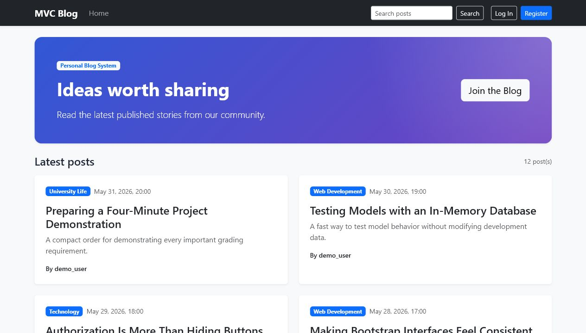
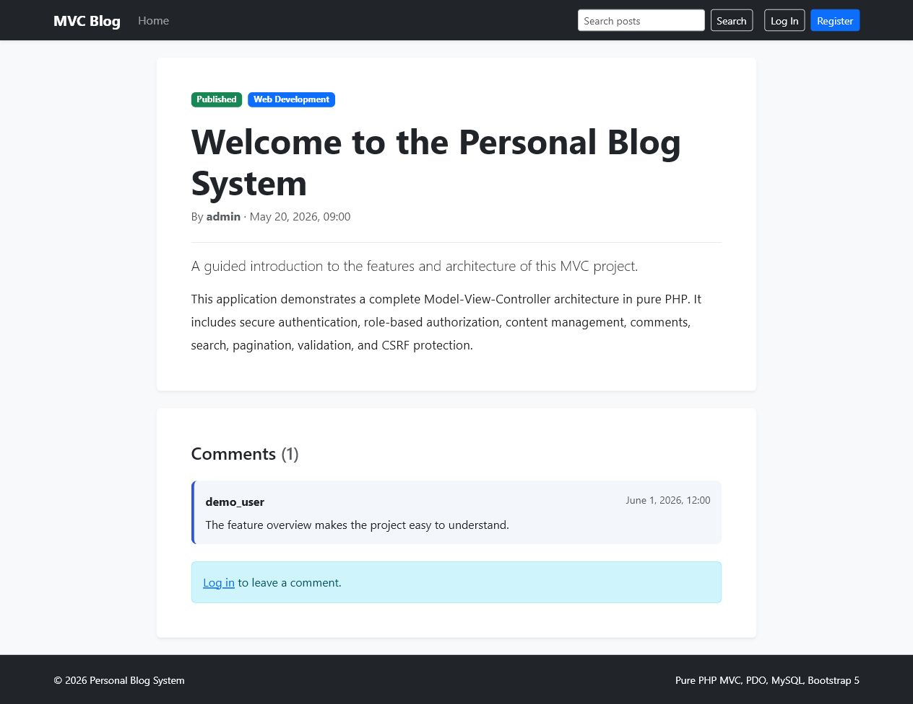
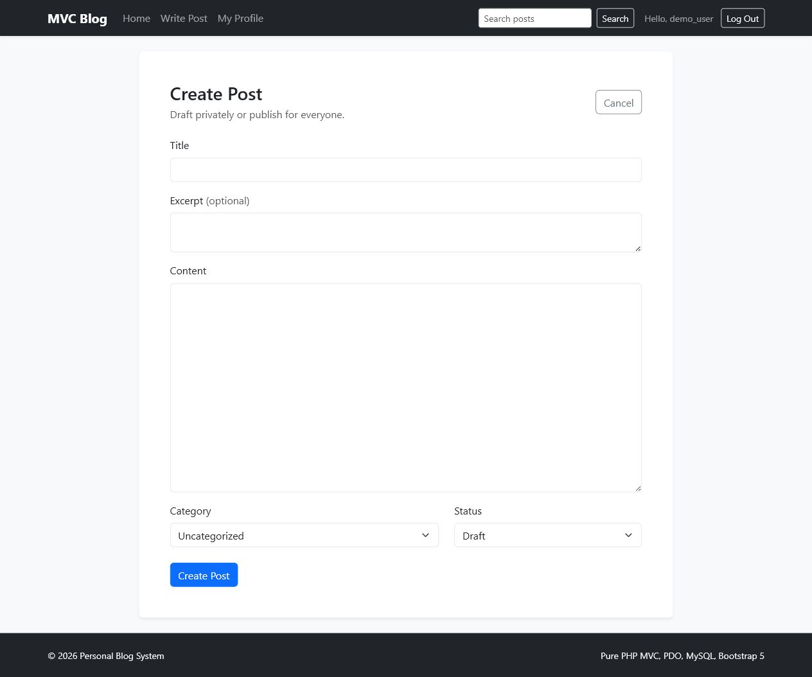
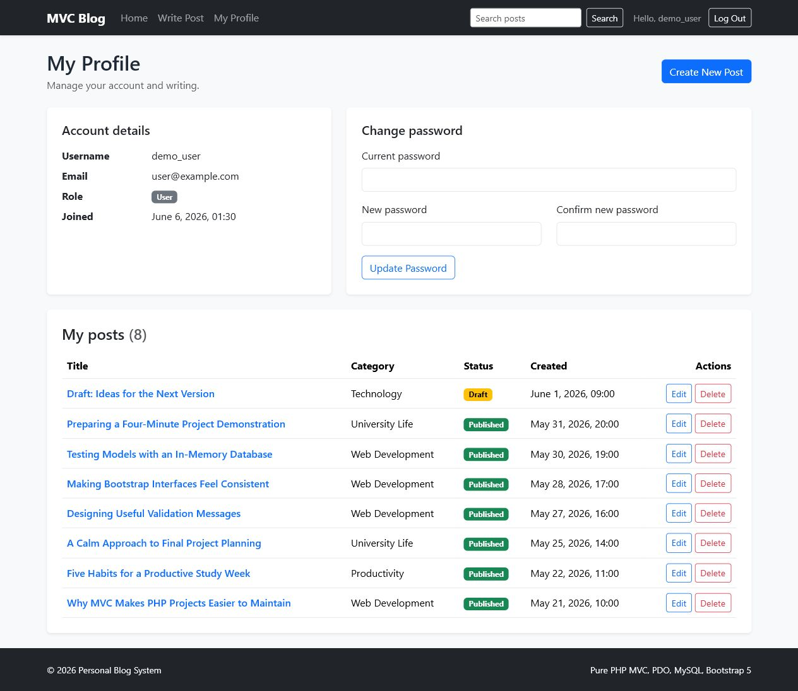
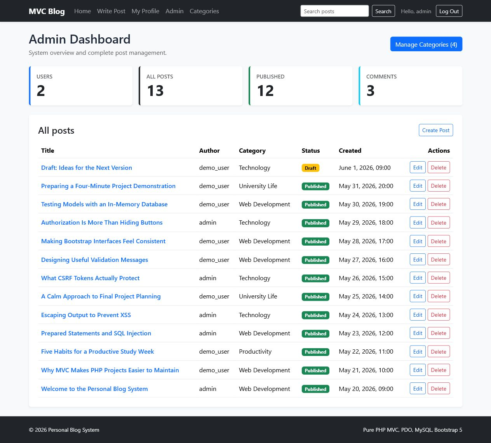
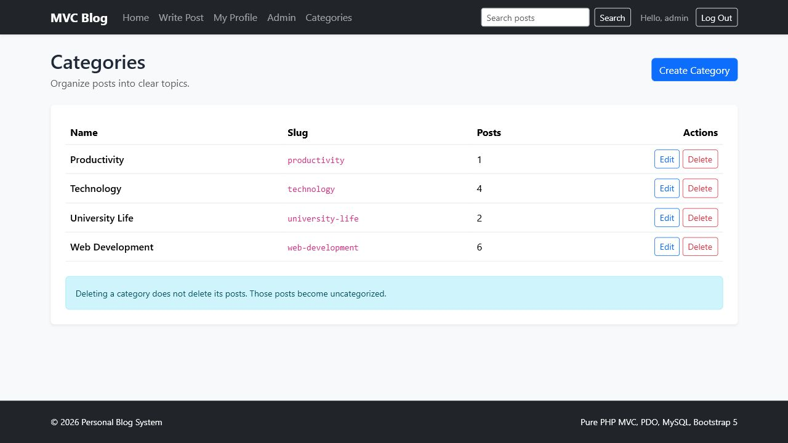

# Personal Blog System

This is my final project for the MVC Web Application Development course. It is a personal blog made in pure PHP without using a framework.

The project uses the MVC pattern, MySQL with PDO, and Bootstrap 5. Users can register, write posts, leave comments, and manage their profiles. There is also an admin panel for managing all posts and categories.

## Main Features

- User registration, login, and logout
- Password hashing with `password_hash()`
- User and admin roles
- Create, read, update, and delete posts
- Draft and published post statuses
- Only the post author or an admin can edit/delete a post
- Category CRUD for admins
- Comments for logged-in users
- Search by post title, content, or author
- Pagination with 10 posts per page
- User profile and password change
- Flash messages and form validation
- CSRF protection on all POST forms
- PDO prepared statements and escaped output
- Responsive Bootstrap 5 design
- PHPUnit model tests

## Project Structure

```text
mvc-blog-system/
|-- app/
|   |-- Controllers/
|   |-- Core/
|   |-- Models/
|   |-- Views/
|   |-- helpers.php
|   `-- middleware.php
|-- docs/screenshots/
|-- public/
|   |-- assets/
|   `-- index.php
|-- tests/
|-- config.php
|-- database.php
|-- database.sql
|-- routes.php
|-- composer.json
|-- phpunit.xml
`-- README.md
```

## How to Run the Project

I used XAMPP with PHP 8.2 and MariaDB.

1. Copy the project folder to:

   ```text
   C:\xampp\htdocs\mvc-blog-system
   ```

2. Start Apache and MySQL in the XAMPP Control Panel.

3. Open [phpMyAdmin](http://localhost/phpmyadmin).

4. Go to **Import** and select the `database.sql` file.

5. Open the project in a browser:

   [http://localhost/mvc-blog-system/public/index.php](http://localhost/mvc-blog-system/public/index.php)

The default XAMPP database settings are already set in `config.php`:

```php
'host' => '127.0.0.1',
'port' => '3306',
'name' => 'mvc_blog_system',
'username' => 'root',
'password' => '',
```

If the project folder has a different name, the `base_url` value in `config.php` also needs to be changed.

## Test Accounts

| Account | Email | Password |
|---|---|---|
| Admin | `admin@example.com` | `Admin123!` |
| User | `user@example.com` | `User123!` |

## Database

The complete database setup and example data are in `database.sql`.

```sql
CREATE DATABASE mvc_blog_system;
USE mvc_blog_system;

CREATE TABLE users (
    id INT AUTO_INCREMENT PRIMARY KEY,
    username VARCHAR(50) UNIQUE NOT NULL,
    email VARCHAR(100) UNIQUE NOT NULL,
    password VARCHAR(255) NOT NULL,
    role ENUM('user', 'admin') DEFAULT 'user',
    created_at TIMESTAMP DEFAULT CURRENT_TIMESTAMP
);

CREATE TABLE categories (
    id INT AUTO_INCREMENT PRIMARY KEY,
    name VARCHAR(100) NOT NULL,
    slug VARCHAR(100) UNIQUE NOT NULL
);

CREATE TABLE posts (
    id INT AUTO_INCREMENT PRIMARY KEY,
    title VARCHAR(255) NOT NULL,
    slug VARCHAR(255) UNIQUE NOT NULL,
    content TEXT NOT NULL,
    excerpt TEXT,
    category_id INT,
    user_id INT NOT NULL,
    status ENUM('draft', 'published') DEFAULT 'draft',
    created_at TIMESTAMP DEFAULT CURRENT_TIMESTAMP,
    updated_at TIMESTAMP DEFAULT CURRENT_TIMESTAMP ON UPDATE CURRENT_TIMESTAMP,
    FOREIGN KEY (category_id) REFERENCES categories(id),
    FOREIGN KEY (user_id) REFERENCES users(id)
);

CREATE TABLE comments (
    id INT AUTO_INCREMENT PRIMARY KEY,
    post_id INT NOT NULL,
    user_id INT NOT NULL,
    content TEXT NOT NULL,
    created_at TIMESTAMP DEFAULT CURRENT_TIMESTAMP,
    FOREIGN KEY (post_id) REFERENCES posts(id) ON DELETE CASCADE,
    FOREIGN KEY (user_id) REFERENCES users(id)
);
```

## How MVC Is Used

- **Models** contain the database queries.
- **Controllers** handle requests, validation, and permissions.
- **Views** contain the HTML and Bootstrap interface.
- `routes.php` connects each route to a controller method.
- `middleware.php` protects pages that require login or admin access.
- The shared layout is in `app/Views/layouts/layout.php`.

## Security

I used PDO prepared statements for database queries and `htmlspecialchars()` when displaying user content. All POST forms have CSRF tokens. Passwords are hashed, sessions are regenerated after login, and permissions are checked in the controllers.

Delete actions use POST requests instead of GET requests. A normal user cannot edit or delete another user's post, even if the URL is changed manually.

## Tests

Install PHPUnit dependencies:

```powershell
composer install
```

Run the tests:

```powershell
vendor\bin\phpunit
```

There are five model tests for:

- Creating a user and hashing the password
- Changing a password
- Searching published posts
- Excluding drafts from public search
- Returning 10 posts on the first pagination page

## Screenshots

### Home Page



### Post Details and Comments



### Creating a Post



### User Profile



### Admin Dashboard



### Category Management



## Author

Created by Murat Serkan Kayar for the MVC Web Application Development final project.
